---

## 🌙 Quiet Night, Building Ideas

  

  

  
  
  
  
  
  

  💻 Vibe Coding &nbsp;•&nbsp;
  🤖 AI &nbsp;•&nbsp;
  🎨 AI Art &nbsp;•&nbsp;
  📱 Android &nbsp;•&nbsp;
  🌐 Web &nbsp;•&nbsp;
  🖼️ Wallpapers &nbsp;•&nbsp;
  ✨ Digital Creativity

  
  
  

---
