## 🌙 Vibe Coding After Dark

  

  

  
  
  
  

  💻 Vibe Coding &nbsp;•&nbsp;
  🤖 AI &nbsp;•&nbsp;
  🎨 PixelSaga &nbsp;•&nbsp;
  🖼️ Wallzivo &nbsp;•&nbsp;
  📱 Android &nbsp;•&nbsp;
  🌐 Web &nbsp;•&nbsp;
  🎮 Gaming-inspired ideas &nbsp;•&nbsp;
  ✨ Creativity

